# blockchain-starter-kit

:warning: :construction: :construction_worker:

> **DISCLAIMER**: this starter kit is a **prototype** that is currently under development by the IBM Blockchain team. As a result, it may dramatically change, have major bugs, completly fail to work, or disappear altogether. There is **no** officially provided support for this starter kit; any bugs that you report may go unfixed for a longer period of time than you're comfortable with. If you're happy with all of that, then please carry on reading! As we work on this starter kit, we're extremely interested in your feedback about how we could make it better, so please do let us know by raising issues on this GitHub repository!

:warning: :construction: :construction_worker:

Hello! This GitHub repository contains a starter kit for building a blockchain application using the IBM Blockchain Platform. The starter kit includes everything you need for developing smart contracts, exposing them via RESTful APIs, and building end user applications. It also includes tooling that allows you to set up an IBM Cloud DevOps toolchain that will automatically deploy your blockchain application, and any future changes you make, to the IBM Cloud.

Follow the steps below to get started:

1. [Setting up the local development environment](#1-setting-up-the-local-development-environment)
2. [Setting up the project and DevOps toolchain](#2-setting-up-the-project-and-devops-toolchain)
3. [Cloning the GitHub repository](#3-cloning-the-github-repository)
4. [Creating a smart contract](#4-creating-a-smart-contract)
5. [Checking the status of the DevOps toolchain](#5-checking-the-status-of-the-devops-toolchain)
6. [Accessing the deployed REST server](#6-accessing-the-deployed-rest-server)
7. [Updating the deployed smart contract](#7-updating-the-deployed-smart-contract)
8. [Creating an application](#8-creating-an-application)
9. [Accessing the deployed application](#9-accessing-the-deployed-application)

## 1. Setting up the local development environment

In order to use this starter kit, you will need to know how to develop blockchain applications. The IBM Blockchain Platform is built on open source technologies from the Linux Foundation Hyperledger Project, including Hyperledger Fabric and Hyperledger Composer.

You will use these skills later on as part of the starter kit, so don't skip ahead!

### Hyperledger Fabric

Hyperledger Fabric is a platform for building blockchain applications. Hyperledger Fabric provides the blockchain technology itself, along with APIs and SDKs that allow you to develop smart contracts and end user applications.

You can learn more about Hyperledger Fabric, including how to set up your local development environment, by following the Hyperledger Fabric tutorials available here: http://hyperledger-fabric.readthedocs.io/en/release-1.1/tutorials.html

In particular, we recommend that you follow the Hyperledger Fabric "Writing Your First Application" and "Chaincode for Developers" tutorials. These tutorials will teach you how to develop a smart contract, and build an end user application.

### Hyperledger Composer

Hyperledger Composer is a framework or layer that builds on top of Hyperledger Fabric, that provides functionality that allows you to model your blockchain business network, and easily generate RESTful APIs and end user applications.

You can learn more about Hyperledger Composer, including how to set up your local development environment, by following the Hyperledger Composer tutorial available here: https://hyperledger.github.io/composer/latest/tutorials/tutorials.html

In particular, we recommend that you follow the Hyperledger Composer development tutorial. This tutorial will teach you how to develop a smart contract, expose it via a RESTful API, and build an end user application.

### Choosing between the two

This starter kit is designed to work with smart contracts developed using either Hyperledger Fabric or Hyperledger Composer. You can choose either of the two, depending on your skills, and the needs of your blockchain solution.

Please note that currently, this starter kit can only generate RESTful APIs for smart contracts developed using Hyperledger Composer. You will need to build your own RESTful API server for smart contracts developed using Hyperledger Fabric.


## 2. Setting up the project and DevOps toolchain

To start building a blockchain application using this starter kit, you must first clone this GitHub repository into a new GitHub repository. You will then develop your blockchain application by working on the cloned GitHub repository. You do not need to manually clone this GitHub repository; please carry on reading!

You also want to set up a DevOps toolchain that will automatically build, test, and deploy your blockchain application to the IBM Cloud. The IBM Cloud DevOps service can be used to to run the DevOps toolchain, and this starter kit includes configuration suitable for use with the IBM Cloud DevOps service.

Click the following link to set up a DevOps toolchain for your blockchain application:

[Set up DevOps toolchain](https://console.bluemix.net/devops/setup/deploy/?repository=https%3A//github.com/sstone1/blockchain-starter-kit&branch=master&env_id=ibm%3Ayp%3Aus-south&deploy-region=ibm%3Ayp%3Aus-south)

The "Create a Toolchain" page will appear:

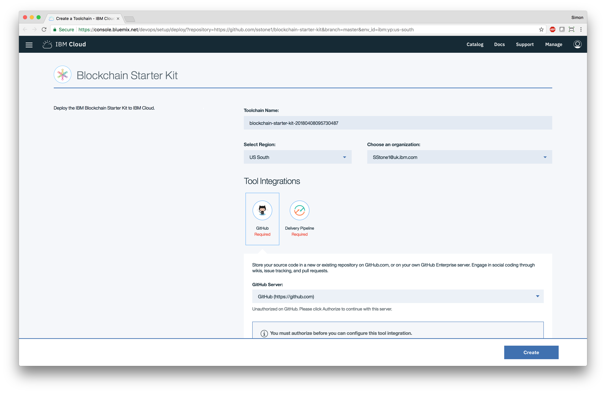

You must need to specify a name for your DevOps toolchain in the "Toolchain Name" field. In this example, I'll use "simons-blockchain-app" as the toolchain name:

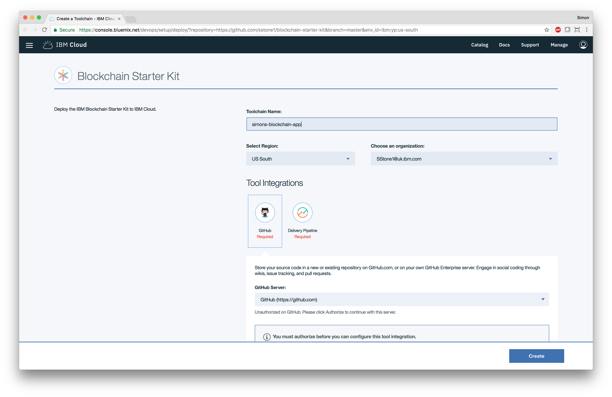

Next, if you haven't authorized the IBM Cloud DevOps service to access your GitHub organization, you will see an "Authorize" button:

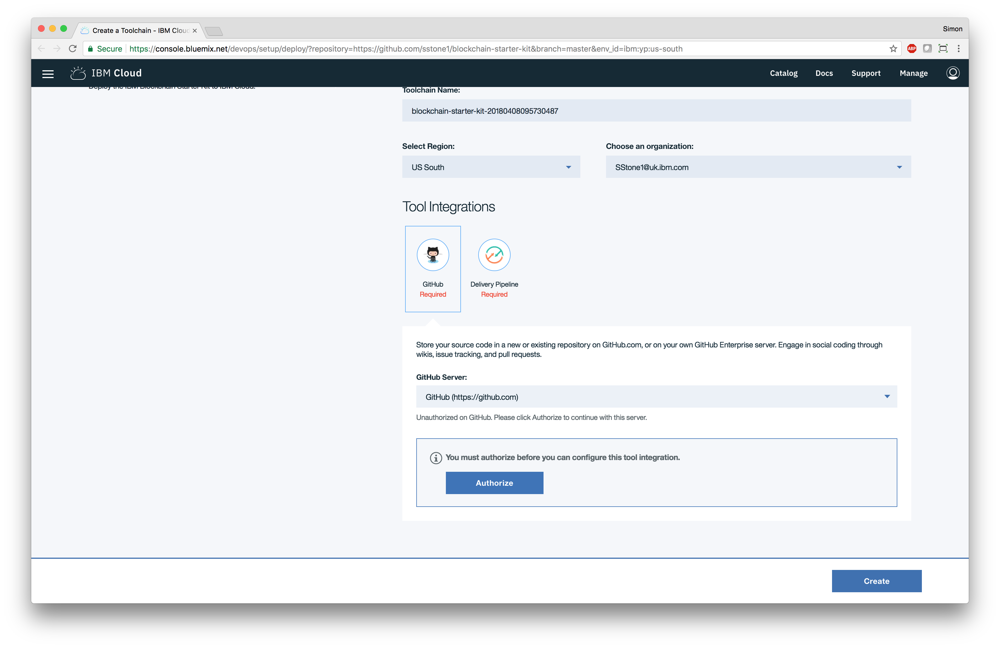

You must click this button and authorize the IBM Cloud DevOps service to access your GitHub organization to continue. You will then see the following options:

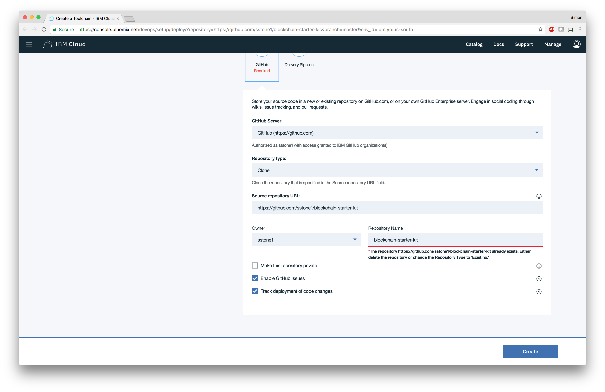

You must now specify a name for your clone of this GitHub repository. We recommend that you give it the same name that you used for the DevOps toolchain. In this example, I'll use "simons-blockchain-app" as the name of the cloned GitHub repository:

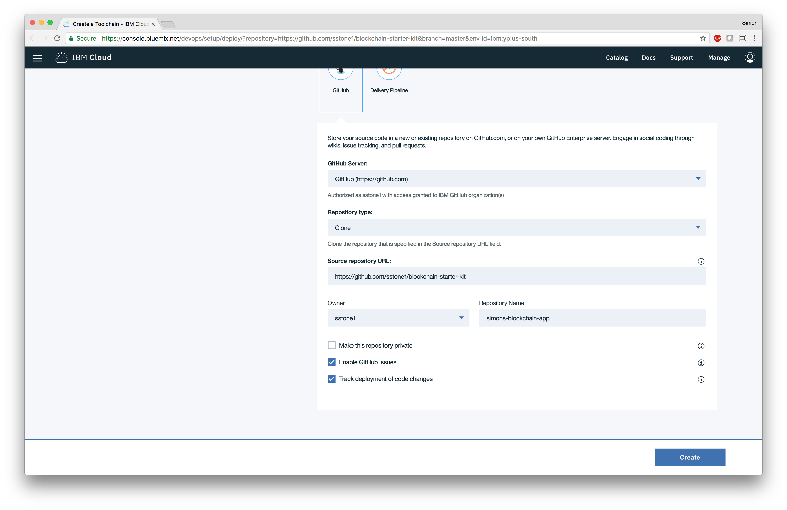

Finally, you must specify a name for the Blockchain service instance you will be using on the Delivery Pipeline form. This can either be an existing service name, or the name of a new Blockchain service to create. Similary for a Cloudant NoSQL DB service which will be used as storage for a Composer wallet. For this example, I'll use "simons-blockchain-service" as the name of the new Blockchain service and "simons-cloudant-service" as the name of the new Cloudant NoSQL DB service.

That's it! Click the "Create" button to create your new DevOps toolchain, and GitHub repository. You should be taken to your newly created DevOps toolchain page:

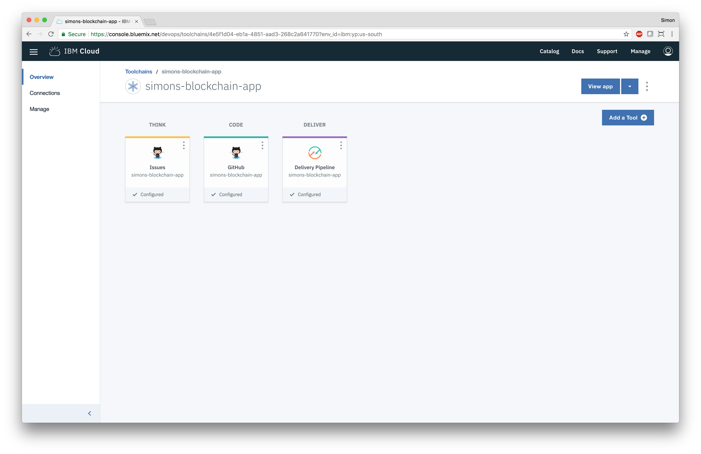

The "GitHub" button in the middle will take you to your newly created GitHub repository. You will clone this GitHub repository into your local development environment, so you can work on your blockchain application.

The "Delivery Pipeline" button on the right will take you to the delivery pipeline for your DevOps toolchain. From here, you can inspect the output from the latest automated build and deployment of your blockchain application.

## 3. Cloning the GitHub repository

Click on the "GitHub" button to go to your newly created GitHub repository. If you are no longer on the DevOps toolchain page, you can find it by navigating to your GitHub organisation on [https://github.com](https://github.com).

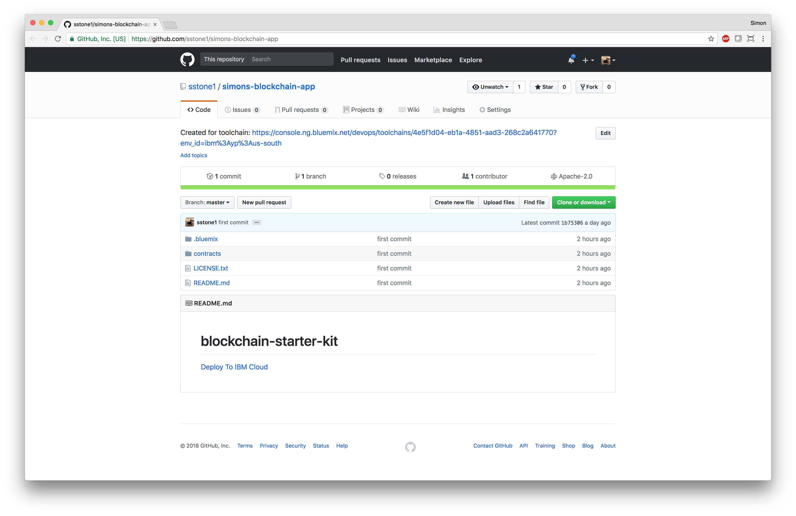

At the top of the page, you can see a link to the DevOps toolchain - useful if you have lost the link and need to find your way back!

Clone this GitHub repository to your local development environment using your favourite Git tool of choice. If you open this repository in an editor such as Visual Studio Code, you should see the following project structure:

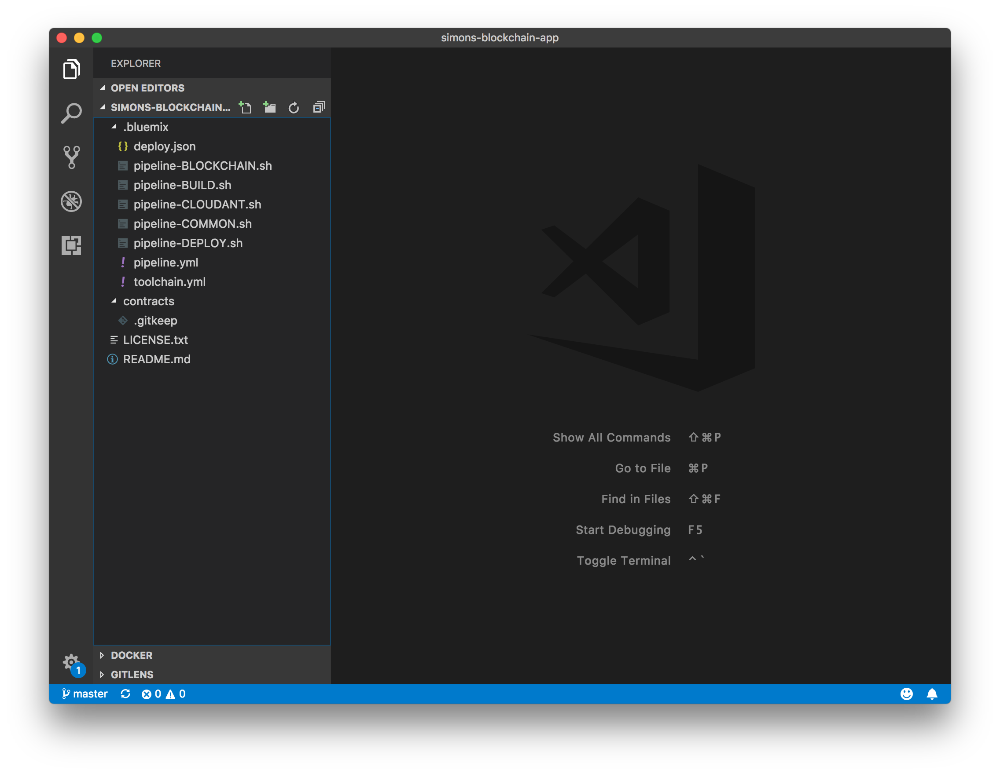

## 4. Creating a smart contract

### Hyperledger Fabric

Create a directory in the `contracts` directory in your GitHub repository. The name of this directory will be the name of the smart contract. Inside this new directory, you can place the Go (.go) files that make up your smart contract developed using Hyperledger Fabric chaincode.

In this example, I have created a smart contract called "marbles":

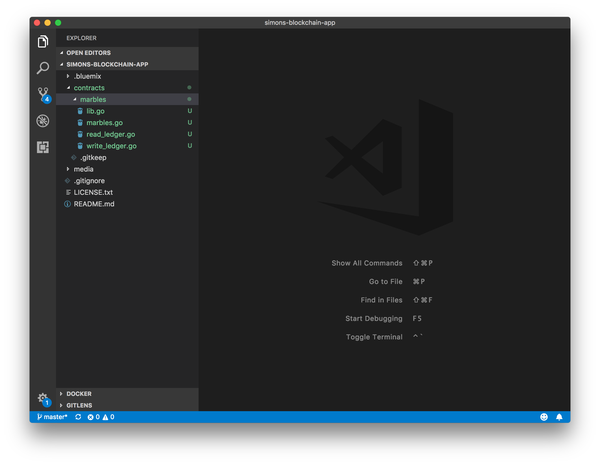

You can work on this smart contract using your favourite editor, following the documentation on the Hyperledger Fabric website.

### Hyperledger Composer

You can use the Yeoman plugin provided by Hyperledger Composer to create a skeleton smart contract for use in your blockchain application. You should have installed Yeoman and this plugin as part of the first step in this guide.

Using the command line, change into the `contracts` directory in your GitHub repository. Run Yeoman using `yo` to generate a skeleton smart contract in this directory. Ensure that you select the "Hyperledger Composer" generator, and then specify that you want to create a "Business Network" project.

In this example, I have created a smart contract called "simons-network":

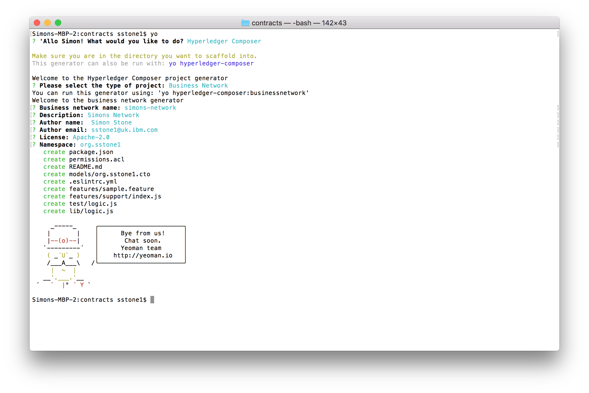

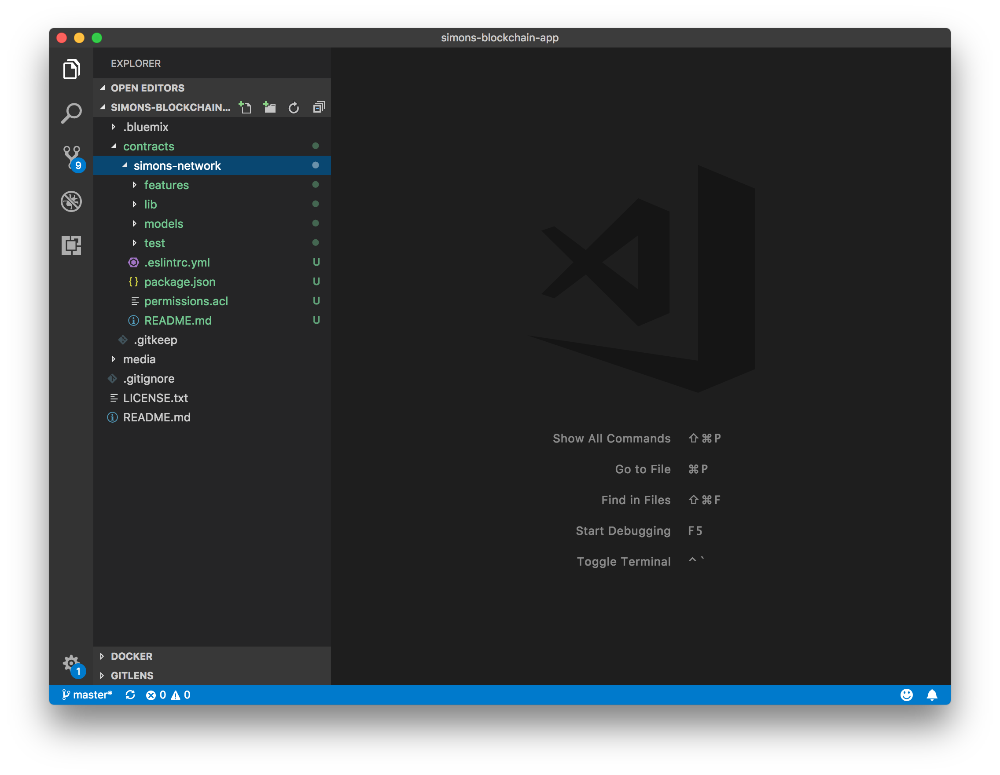

You can work on this smart contract using your favourite editor, following the documentation on the Hyperledger Composer website.

### Pushing the changes

The new smart contract will appear as pending changes in your GitHub repository. Add, commit, and push these changes into your GitHub repository. The DevOps toolchain you created earlier will detect these changes, and then automatically build, test, and deploy those changes to the IBM Cloud.

## 5. Checking the status of the DevOps toolchain

Navigate to the DevOps toolchain page, and click on the "Delivery Pipeline" button. You should see the following page, giving you an overview of the current status of your delivery pipeline:

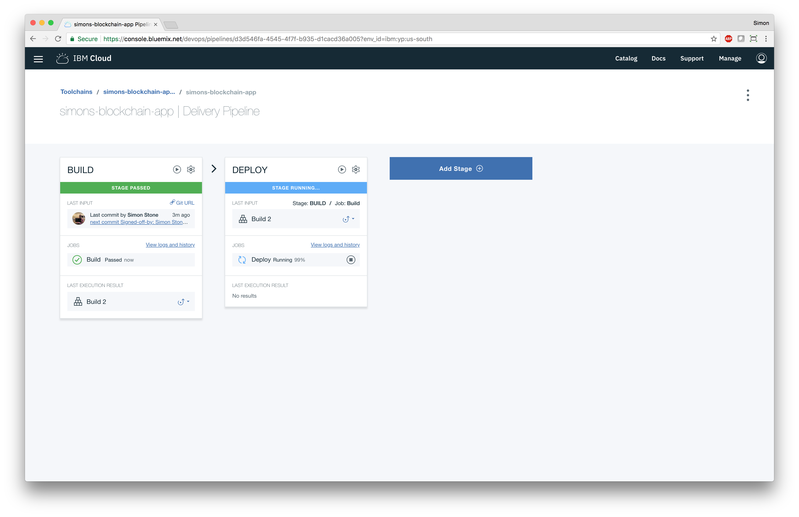

The delivery pipeline is made up of two phases, "BUILD" and "DEPLOY".

The "BUILD" phase of the delivery pipeline clones your GitHub repository, installs any dependencies, and runs all of the automated unit tests for all of your smart contracts. If any unit tests fail, then the delivery pipeline will fail and your changes will not be deployed.

The "DEPLOY" phase of the delivery pipeline deploys your smart contracts into the IBM Cloud. It is reponsible for provisioning and configuring an instance of the IBM Blockchain Platform: Starter Plan (the blockchain network), an instance of Cloudant (the wallet for blockchain credentials), deploying the smart contracts, and deploying RESTful API servers for each deployed smart contract.

If you click "View logs and history", you can see the latest logs for your build:

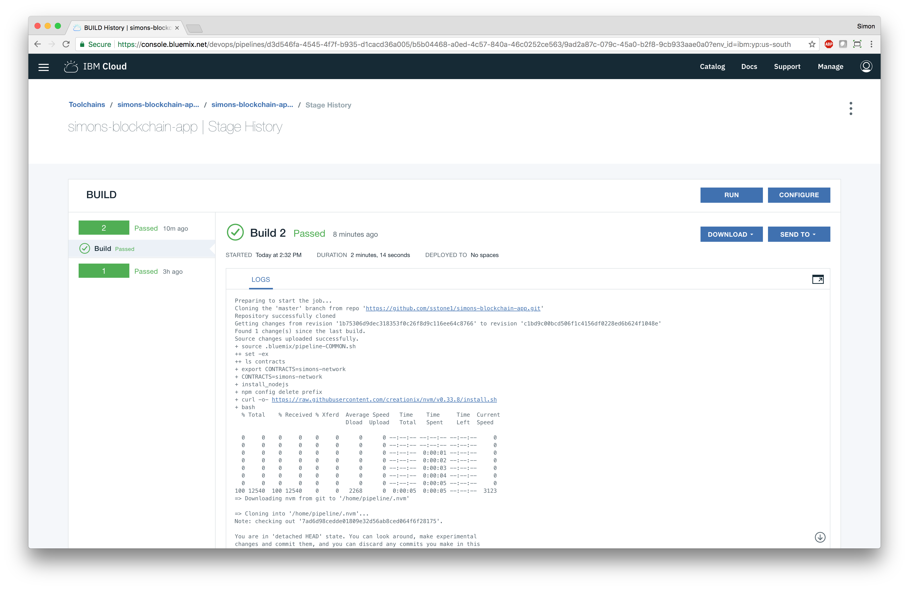

Both "BUILD" and "DELIVERY" phases should be green and showing that no errors have occurred. If this is not the case, you must use the logs to investigate the cause of the errors.

## 6. Accessing the deployed REST server

### Hyperledger Fabric

Currently, this starter kit does not deploy a RESTful API server for smart contracts developed using Hyperledger Fabric.

### Hyperledger Composer

The DevOps toolchain has automatically deployed a RESTful API server for each deployed smart contract. You can use these RESTful APIs to build end user applications that interact with a smart contract.

The URLs for the deployed RESTful API servers are available in the logs for the "DELIVERY" phase, but you can also find them in the [IBM Cloud Dashboard](https://console.bluemix.net/dashboard/apps). The RESTful API server is deployed as an application, with a name made up of "composer-rest-server-" and the name of the smart contract. In this example, the RESTful API server is called "composer-rest-server-simons-network":

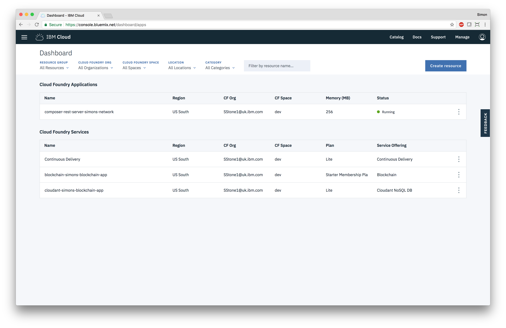

Click on the application in the list to navigate to the application details page:

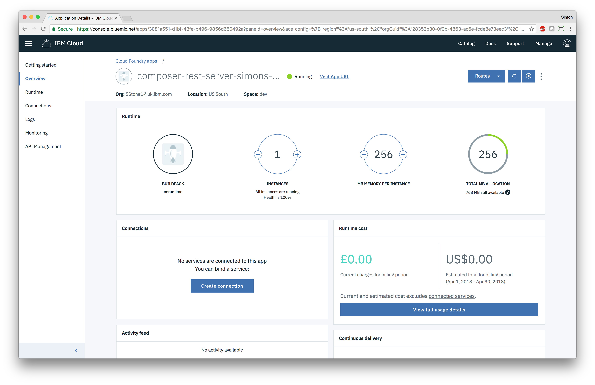

Click on the "Visit App URL" link at the top to navigate to the RESTful API explorer, that allows you to discover and try out the RESTful APIs for your deployed smart contract:

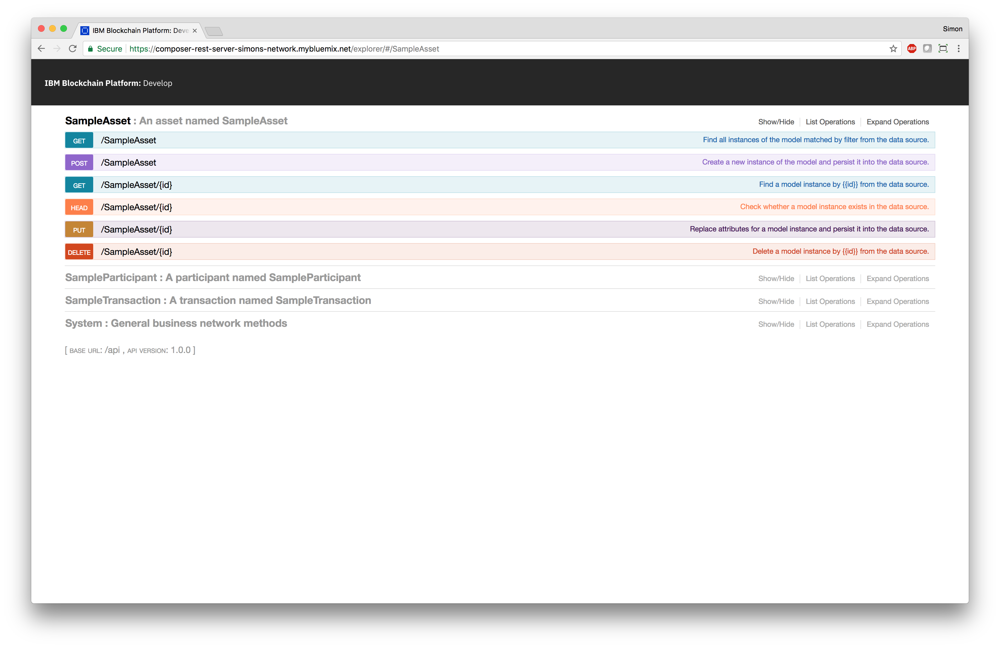

## 7. Updating the deployed smart contract

### Hyperledger Fabric

Changes to deployed smart contracts will also be automatically deployed by the DevOps toolchain as well. You can test this by changing the code in a `.go` file in your smart contract.

Add, commit, and push these changes into your GitHub repository. The DevOps toolchain you created earlier will detect these changes, and then automatically build, test, and deploy those changes to the IBM Cloud.

### Hyperledger Composer

Changes to deployed smart contracts will also be automatically deployed by the DevOps toolchain as well. You can test this by adding a new asset definition to a `.cto` file in your smart contract, for example:

```
asset SimonsAsset extends SampleAsset {

}
```

Add, commit, and push these changes into your GitHub repository. The DevOps toolchain you created earlier will detect these changes, and then automatically build, test, and deploy those changes to the IBM Cloud.

The RESTful API server will be automatically restarted as part of the deployment, and new RESTful APIs will be available for the new asset type that you have defined:


## 8. Creating an application

### Hyperledger Fabric

Currently, this starter kit does not assist you in creating applications that can interact with smart contracts developed using Hyperledger Fabric. You will need to develop your own applications from scratch.

Add your applications into the GitHub repository by creating a directory in the `apps` directory in your GitHub repository. The name of this directory will be the name of the application. Inside this new directory, you can place the files that make up your application. You can use any technology you like to develop your applications, but you must provide a Cloud Foundry manifest file named `manifest.yml`. This Cloud Foundry file describes how to deploy to and run your application in the IBM Cloud.

In this example, I have created an application called "marbles":

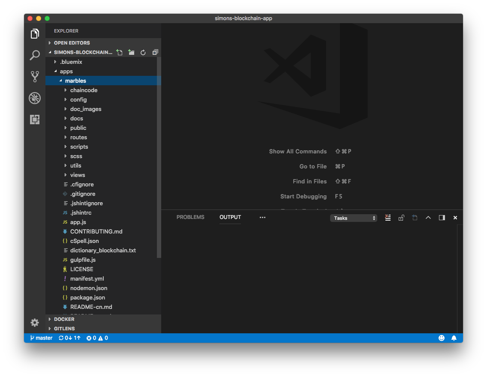

The contents of the `manifest.yml` file at the bottom of the editor tell Cloud Foundry the command for running this application, the number of instances of the application to start, and the amount of memory each instance is given. For example:

```yaml
---
applications:
- disk_quota: 1024M
  name: marbles
  command: "node app.js"
  path: "."
  instances: 1
  memory: 256M
```

See the Cloud Foundry and IBM Cloud documentation for further information on this file.

All applications deployed by this starter kit will be automatically bound to the IBM Blockchain Platform: Starter Plan instance (the blockchain network) that was created earlier. The applications can access connection information for the blockchain network from by reading the `VCAP_SERVICES` environment variable. Here is an example value for the `VCAP_SERVICES` environment variable:

```json
{
    "ibm-blockchain-5-prod": [
        {
            "credentials": {
                "org1": {
                    "url": "https://ibmblockchain-starter.ng.bluemix.net",
                    "network_id": "n334cef0ca48c47f884dad18a9387f36c",
                    "key": "org1",
                    "secret": "xxxxxxxx"
                },
                "org2": {
                    "url": "https://ibmblockchain-starter.ng.bluemix.net",
                    "network_id": "n334cef0ca48c47f884dad18a9387f36c",
                    "key": "org2",
                    "secret": "xxxxxxxx"
                }
            },
            "syslog_drain_url": null,
            "volume_mounts": [],
            "label": "ibm-blockchain-5-prod",
            "provider": null,
            "plan": "ibm-blockchain-plan-v1-starter-prod",
            "name": "blockchain-simons-blockchain-app",
            "tags": [
                "blockchain",
                "ibm_created"
            ]
        }
    ]
}
```

### Hyperledger Composer

You can use the Yeoman plugin provided by Hyperledger Composer to create a skeleton Angular web application. You should have installed Yeoman and this plugin as part of the first step in this guide.

Using the command line, change into the `contracts` directory in your GitHub repository. Run Yeoman using `yo` to generate a skeleton Angular web application in this directory. Ensure that you select the "Hyperledger Composer" generator, and then specify that you want to create an "Angular" project.

In order to run this command, you will need the business network archive (.bna) file for the currently deployed version of the smart contract.

In this example, I have created an application called "simons-app":

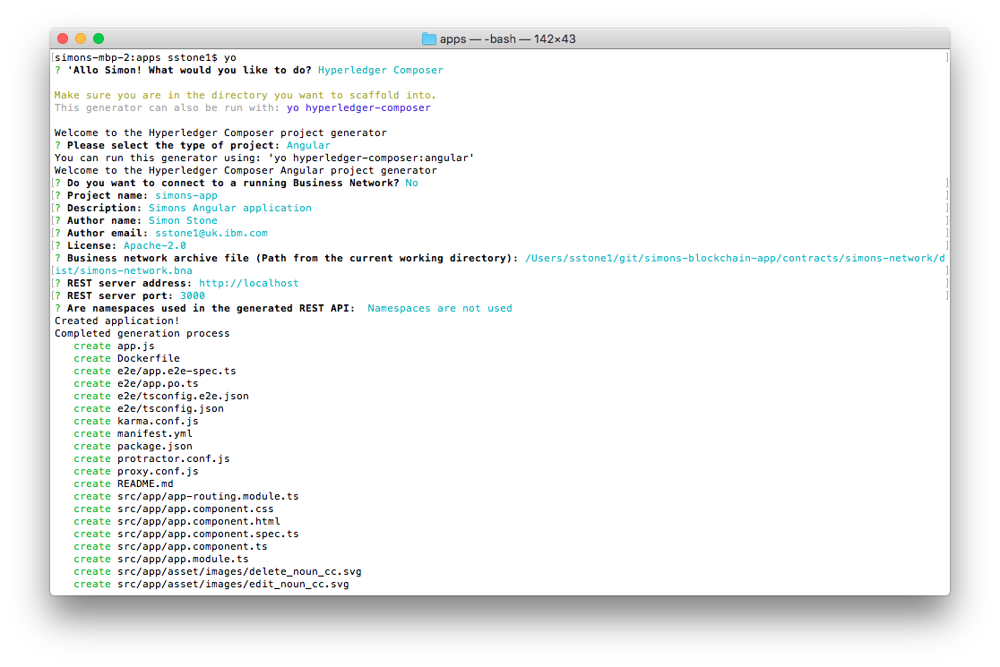

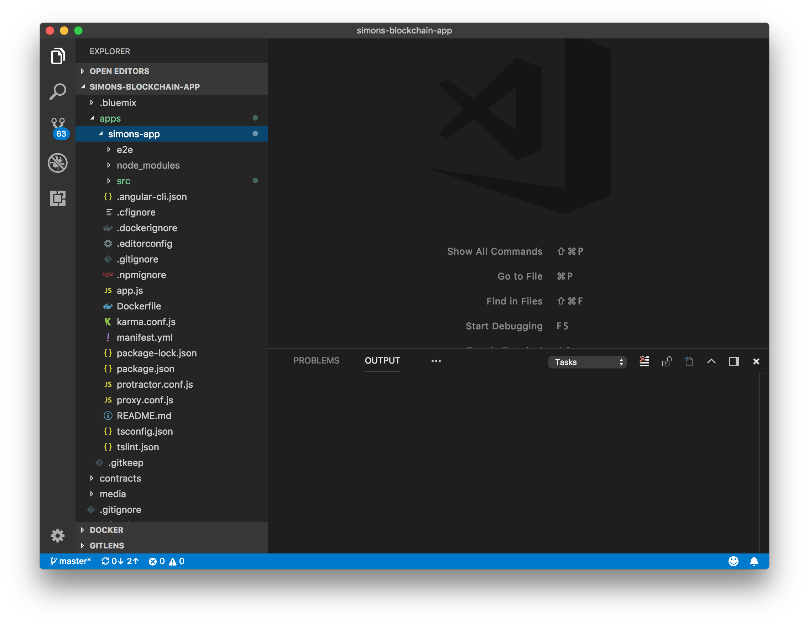

The generated application includes a Cloud Foundry manifest file named `manifest.yml`. This Cloud Foundry file describes how to deploy to and run your application in the IBM Cloud.

The contents of the `manifest.yml` file at the bottom of the editor tell Cloud Foundry the command for running this application, the number of instances of the application to start, and the amount of memory each instance is given.

See the Cloud Foundry and IBM Cloud documentation for further information on this file.

Applications can access the deployed RESTful API server in order to interact with the smart contract. Applications deployed by this starter kit can discover the URL of the RESTful API server by reading the `REST_SERVER_URLS` environment variable, which contains a mapping of business network name to RESTful API server URLs. Here is an example value for the `REST_SERVER_URLS` environment variable:

```json
{
    "simons-network": "https://composer-rest-server-simons-network.mybluemix.net"
}
```

Generated applications automatically read and use the RESTful API server URL in the `REST_SERVER_URLS` environment variable.

Finally, all applications deployed by this starter kit will be automatically bound to the IBM Blockchain Platform: Starter Plan instance (the blockchain network) that was created earlier. The applications can access connection information for the blockchain network from by reading the `VCAP_SERVICES` environment variable. Here is an example value for the `VCAP_SERVICES` environment variable:

```json
{
    "ibm-blockchain-5-prod": [
        {
            "credentials": {
                "org1": {
                    "url": "https://ibmblockchain-starter.ng.bluemix.net",
                    "network_id": "n334cef0ca48c47f884dad18a9387f36c",
                    "key": "org1",
                    "secret": "xxxxxxxx"
                },
                "org2": {
                    "url": "https://ibmblockchain-starter.ng.bluemix.net",
                    "network_id": "n334cef0ca48c47f884dad18a9387f36c",
                    "key": "org2",
                    "secret": "xxxxxxxx"
                }
            },
            "syslog_drain_url": null,
            "volume_mounts": [],
            "label": "ibm-blockchain-5-prod",
            "provider": null,
            "plan": "ibm-blockchain-plan-v1-starter-prod",
            "name": "blockchain-simons-blockchain-app",
            "tags": [
                "blockchain",
                "ibm_created"
            ]
        }
    ]
}
```

### Pushing the changes

The new application will appear as pending changes in your GitHub repository. Add, commit, and push these changes into your GitHub repository. The DevOps toolchain you created earlier will detect these changes, and then automatically build, test, and deploy those changes to the IBM Cloud.

## 9. Accessing the deployed application

The DevOps toolchain has automatically deployed each application.

The URLs for the deployed applications are available in the logs for the "DELIVERY" phase, but you can also find them in the IBM Cloud Dashboard. In this example, the application is called "simons-app":

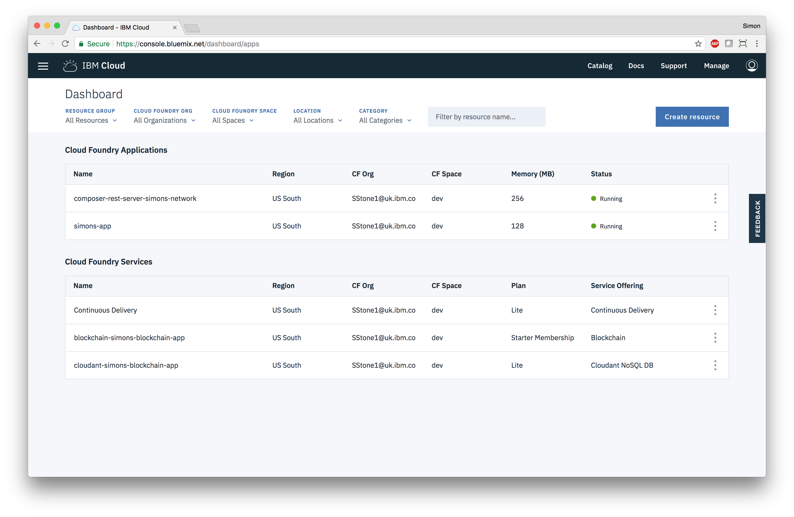

Click on the application in the list to navigate to the application details page:

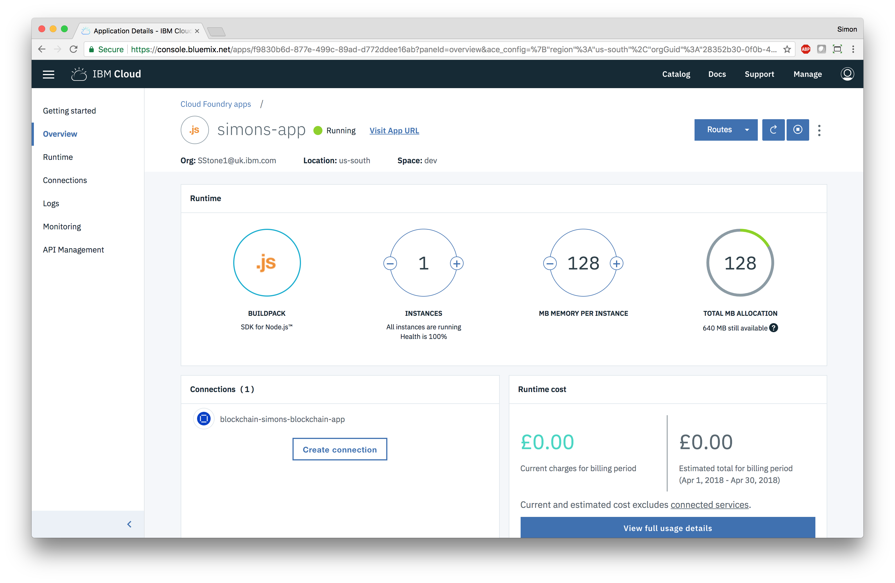

Click on the "Visit App URL" link at the top to navigate to the application:

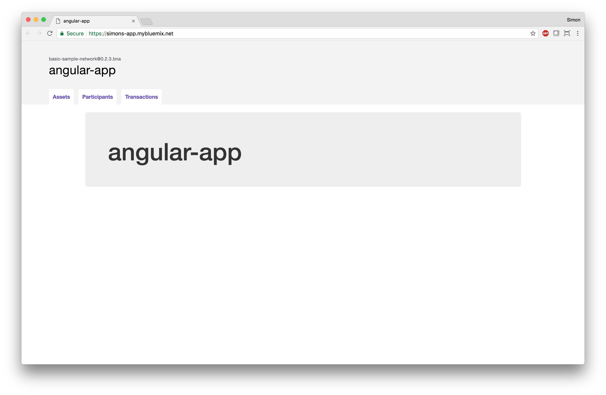
